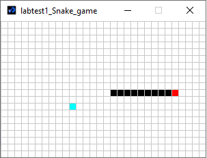
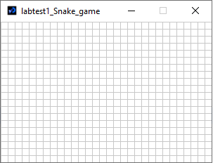
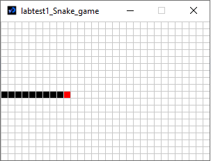
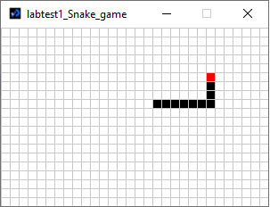

# Game Programming Lab Test 1 2021

Welcome to YOUR 1ST GAME CREATION



## Rules of the test
- Create a Snake game sketch
- Remember to save your work often!
- Put a comment at the top of your sketch with your name and student number
- Put comments in your code to explain what is happening
- Submit your sketch to BrightSpace when you are finished
- This is an open book test. You can use the Processing reference, my git repository and your own notes, but no use of Google/Facebook and no conferring


## Instructions
Please follow the instructions and you will have a perfect game to play after the test.

- Define 2 standard functions ```setup()``` and ```void()```. In function ```setup()``` set the size of screen to ```(300,200)```. In function ```draw()``` set the background to white.

- In order to draw a grid for the game, you need to define the fixed cell_size and the number of rows/columns of the grid. Now, create 3 global variables accordingly.

In the definition, let's put ```int cell_size = 10;``` 

After that initialise variable ```rows``` and ```cols``` in function ```setup()```. Remember if the cell size is 10, the grid should have 30 rows (equivalent 300 pixels in y axis) and 20 columns (200 pixels in x axis). Don't hard code these values, use division operations as you already have all variables (values) for this.

- Create function to draw the grid and call it in ```draw()```. The code block is provided below (as it uses nested loops).
```
  noFill();
  stroke(200);
  
  for (int i = 0; i < cols; i++) {
    for (int j = 0; j < rows; j++) {
      rect(change_coordination(i), change_coordination(j), cell_size, cell_size);
    }
  }
```

Pay attention to the use of function ```change_coordination(i)``` and ```change_coordination(j)```, that converts column i-th and row j-th to coordination (x, y) of the cell. You need to write this function, that we pass the value of i or j, it returns the value of x and y. The body of this function is simple (provided below), but you need to figure how to define the function itself.
```
  return i * cell_size;
```

In the result the grid should look like this:



- Next thing, you need to define the snake. The snake is defined by ```snake_length``` (the current length of snake) and its coordinations by rows and columns for each part. Here you finish the code to define 2 arrays for the snake's coordinations, with max length of the array being 100.
```
  int snake_length = 10;
  int[] snake_col = ...
  int[] snake_row = ...
``` 

- Since all parameters for the snake are set, you need to initialise them in function ```setup()```. Let's say you let the snake in the middle of the screen like this.



Hint: use 1 for loop to initialise the elements of 2 arrays ```snake_col``` and ```snake_row```

- Now you guess it right. You need to create a function to draw the snake and call it in the main function ```draw()```. When you do it correctly, it shows as the above picture. For simplicity when drawing the snake, let's say its head is the last element in the arrays.
```
  // Draw the snake's body with black colour.
  fill(...);
  stroke(200);
  for (int i = 0; ...; ...) {
    rect(..., ..., ..., ...);
  }
  
  // Draw the snake's head with red colour.
  fill(...);
  stroke(200);
  rect(..., ..., ..., ...);
```

- How about a moving snake? Sounds fascinating, right? Yes you guess it right, the snake moves by 1 grid cell every cycle.



- The first step of moving snake is to define the initial moving direction, i.e. you need to define the moving variables.
```
  int move_col;
  int move_row;
```
Now, saying that the moving direction is to the right by default. How do you initialise these variables?

- The second step is to make the snake move every cycle. Now let's define a moving function. Here you need a for loop to move all the snake's parts 1 step towards the head, then the head 1 step towards the current moving direction.
```
  \\ Put your moving code here.
  ...
  
  \\ My control block. If you can explain what it does in the comment, I'll give you extra points.
  for (int i = 0; i < snake_length; i++) {
    if (snake_col[i] >= cols) {
      snake_col[i] -= cols;
    }
    if (snake_col[i] < 0) {
      snake_col[i] += cols;
    }
    
    if (snake_row[i] >= rows) {
      snake_row[i] -= rows;
    }
    if (snake_row[i] < 0) {
      snake_row[i] += rows;
    }
  }
```

- Congratulations, you've reached the last step. Of course the snake doesn't move only 1 direction. Now you need to change its direction. The function is provided. You need to finish it by puting the conditions in. Remember the snake can change direction only by 90-degree angles.
```
void keyPressed() {
  if (key == CODED) {
    if (keyCode == UP) {
      // Change direction to go up
      ...
      }
    }
    
    if (keyCode == DOWN) {
      // Change direction to go down
      ...
    }
    
    if (keyCode == LEFT) {
      // Change direction to go left
      ...
    }
    
    if (keyCode == RIGHT) {
      // Change direction to go right
      ...
    }
  }
}
```

- Now putting all the codes together and you have your moving snake on the board. Important to know that you don't need to call function ```keyPressed()``` (defined just above) in function ```draw()```, but you need to call other functions you defined throughout the task. 

- In function ```draw()``` set the delay time in range ```50-200``` to control the snake's speed.


## Marking Scheme:

| Feature | Mark |
|---------|------|
| Define all variables | 10 |
| Variable initialisation | 10 |
| Draw the snake | 15 |
| Moving the snake | 15 |
| Explaining the control code block | 10 |
| Changing the snake's direction | 20 |
| Code style, commenting & solution elegance | 20 |

## Extra stuff you can do to finish your game creation (just for fun)

- Let's say the snake here is vegetarian. A fruit appears randomly and periodically on the grid and waits for the snake to eat it. It doesn't disappear as long as the snake doesn't eat it. When it's eaten, another fruit will apear after an interval of time.
- When the snake eat a fruit, it grows by increasing its length by one.
- The game continues as long as the snake doesn't bite its body/tail.
- Very extra stuff: create a maze.

As I promised, if you do this extra stuff, you can earn extra points for the assignment or make up the lost points in the test, whichever is applicable.

